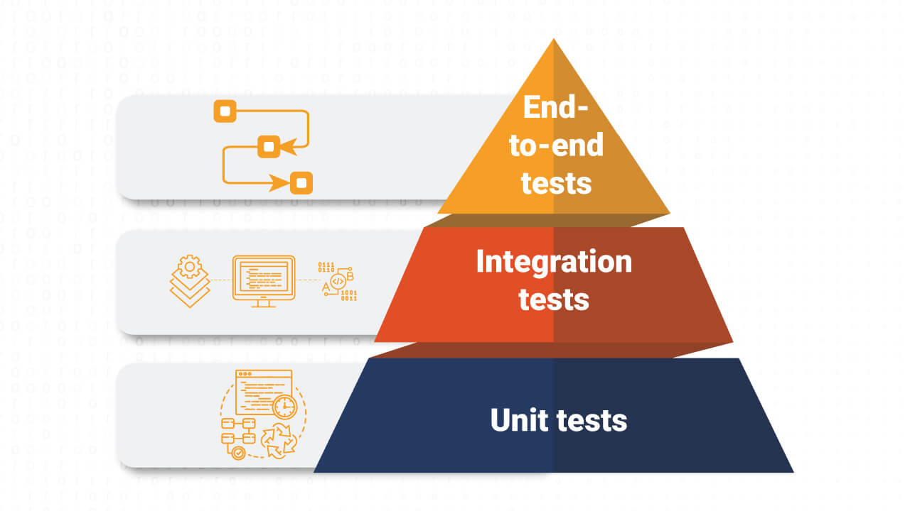

# Test Automation Workshop

## Background

This is the material for my workshop at [GovTech STACK Conference 2024](https://govtechstack.sg) ([Slides](https://docs.google.com/presentation/d/1AQDbr3-gdXzhQ3oHowwQEA2JtSHNrZ5s/edit?usp=sharing&ouid=101651439519857751992&rtpof=true&sd=true)).

This workshop will take folks on a learning adventure of how software engineers in GovTech use Automated Testing in building high-quality software products for public good. Attendees will be introduced to the different layers of the Testing Pyramid and the tools that software engineers in GovTech use to support that layer of automated testing.

Attendees will be given a number of self-paced hands-on labs to have a taster on the different kind of testing tools available. Through these, participants will learn about different kinds of test automation tools used in software engineering. Specifically for full-stack web development.

## Pre-requisites (for attendees)

- Basic understanding of programming concepts.
- Familiarity with JavaScript, Python or Java programming languages.
- Familiarity with Git and GitHub (you will need a [GitHub](https://github.com/) user account).
- Familiarity with web development concepts.
- Familiarity with REST API concepts.

## Concept

Through this workshop, I aim to introduce the different testing tools used by modern full-stack software engineers in developing web applications.

We will cover the tools used in the [Test Pyramid](https://martinfowler.com/bliki/TestPyramid.html): **Unit Testing**, **Integration Testing** and **End-to-End Testing**.

## Sample Application

We will use a To Do List app to help illustrate the concepts. The To Do List app will have these features:

- List of To Do Items
- Add new To Do Item
- Delete To Do Item
- Edit a To Do Item
- Mark Item as Done / Not Done
- Clear Completed To Do Items from the list (to be implemented as part of the exercises)

### Components

- Frontend App
  - The To Do List frontend is a web application built with JavaScript.
    - [VueJS](https://vuejs.org) for the SPA[^SPA] framework.
    - [Vitest](https://vitest.dev) for the Unit Tests.
- Backend App
  - The To Do List backend is a REST API server built in 3 programming languages.
  - JavaScript:
    - [Express.js](https://expressjs.com) for the web framework.
    - [Sequelize](https://sequelize.org) for the ORM[^ORM].
    - [Vitest](https://vitest.dev) for the Unit Tests.
    - [SQLite3](https://www.sqlite.org) for the database.
  - Python:
    - [FastAPI](https://fastapi.tiangolo.com) for the web framework.
    - [SQLAlchemy](https://www.sqlalchemy.org) for the ORM[^ORM].
    - [Pytest](https://pytest.org) for the Unit Tests.
    - [SQLite3](https://www.sqlite.org) for the database.
  - Java:
    - [Spring Boot](https://spring.io) for the web framework.
    - [Spring Data JPA](https://spring.io/projects/spring-data-jpa) for the ORM[^ORM].
    - [Junit](https://junit.org/junit5) for the Unit Tests.
    - [H2](https://h2database.com) for the database.
- End-to-End Tests
  - This will automate a web browser and interact with the application like a normal user. This way, we have a repeatable and predictable way of verifying the features.
    - [Playwright](https://playwright.dev/) for the E2E testing framework. We can write tests in [JavaScript](https://playwright.dev/docs/intro), [Python](https://playwright.dev/python/docs/intro) or [Java](https://playwright.dev/java/docs/intro).

## Hands-on Lab Exercises

We will be using [GitHub Codespace](https://docs.github.com/en/codespaces/overview) (via [Devcontainers](https://code.visualstudio.com/docs/devcontainers/containers)) for these exercises. You can use this IDE[^IDE] in the browser or in [Visual Studio Code](https://docs.github.com/en/codespaces/developing-in-a-codespace/using-github-codespaces-in-visual-studio-code) on your laptop.

- [Exercise 1: Fork the Workshop Repository](./docs/exercises/exercise1.md)
- [Exercise 2: Start a Codespace](./docs/exercises/exercise2.md)
- [Exercise 3: Open your Code Workspace](./docs/exercises/exercise3.md)
- [Exercise 4: Intro to your IDE (Integrated Development Environment) - Visual Studio Code (VSCode)](./docs/exercises/exercise4.md)
- [Exercise 5: Intro to the Frontend App](./docs/exercises/exercise5.md)
- [Exercise 6: Intro to the Backend App](./docs/exercises/exercise6.md)
- [Exercise 7: Running the To Do List app](./docs/exercises/exercise7.md)
- [Exercise 8: Intro to the Playwright End-to-End Test](./docs/exercises/exercise8.md)
- [Exercise 9: About the new feature](./docs/exercises/exercise9.md)
- [Exercise 10: Updating the Backend](./docs/exercises/exercise10.md)
- [Exercise 11: Updating the Frontend](./docs/exercises/exercise11.md)
- [Exercise 12: Updating the End-to-End Test](./docs/exercises/exercise12.md)
- [Exercise 13: Review the changes](./docs/exercises/exercise13.md)
- [Exercise 14: Bonus Exercises](./docs/exercises/exercise14.md)

## Coding with AI

- [How we created the sample application using AI tools.](./docs/coding_with_ai.md)

[^ORM]: Object Relational Mapping
[^IDE]: Integrated Development Environment
[^SPA]: Single Page Application
