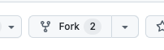
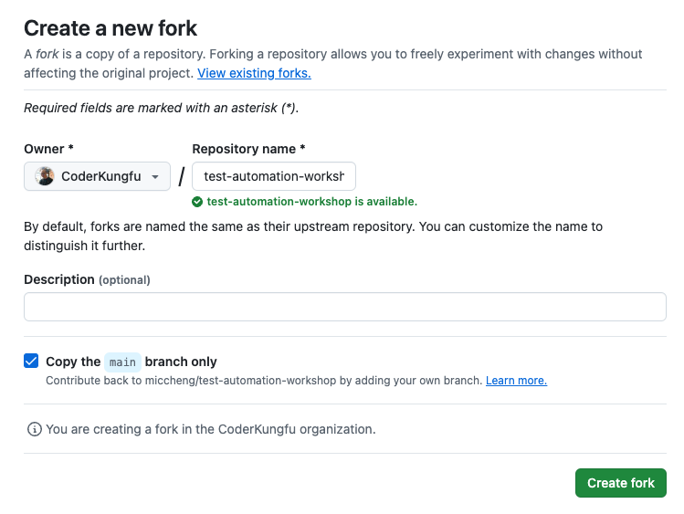

# Exercise 1: Fork the Workshop Repository

1. Go to the workshop repository in GitHub: <https://github.com/miccheng/test-automation-workshop>
2. Click on the **"Fork"** button to ceate a [fork](https://docs.github.com/en/pull-requests/collaborating-with-pull-requests/working-with-forks/fork-a-repo) of the repository.

   

3. Select the organization where you want to fork the repository to.

   

4. Click on **"Create fork"** to fork the repository to your organization / personal space.

[Next Exercise](./exercise2.md)
