# Exercise 10: Updating the Backend

Let's work on the first user story:

- [ ] `AC-1`: **Backend** API endpoint (`POST /todos/clear-completed`) to clear completed To Do Tasks.

Skip to the portion for your preferred programming language:

- [JavaScript](#javascript)
- [Python](#python)
- [Java](#java)

## JavaScript

### Updating the Unit Test

1. In the **"Backend App"** workspace, open the test file: `test/todoRoutes.test.js`

2. Near the end of the file (after line 76), add this test function:

   ```javascript
   it("should clear completed tasks", async () => {
     // New test goes here...
   });
   ```

3. We will add the new test code now:

   ```javascript
   it("should clear completed tasks", async () => {
     // Arrange
     await Todo.create({ task: "Done task 1", completed: true });
     await Todo.create({ task: "Done task 2", completed: true });
     await Todo.create({ task: "Procratinating task", completed: false });

     // Act
     await request(app).post(`/todos/clear-completed`).expect(200);

     // Assert
     const remainingTodos = await Todo.findAll();
     expect(remainingTodos).toHaveLength(1);
     expect(remainingTodos[0].task).toEqual("Procratinating task");
   });
   ```

   - The test code will first **Arrange** the stuff we need before we run the test code. In this case, it is creating a 3 To Do items in the Database first - 2 of which are already marked as completed. We sometimes call this a Data Fixture.
   - Next we will **Act** - by executing the new API endpoint.
   - Lastly, we will **Assert** the result (or side effect) of the action above. After making the API call, the completed tasks should be removed from the Database. As such there should only be 1 To Do item left in the database.

   > **Note:** Remember to save the file.

4. Let's run the test by pressing on the "Play" button tha appears in the left gutter next to your test function.

   

5. The first time you run this, the test should fail (and it's okay). This is because we have not written any production code yet.

   

   Now we can proceed to add the production code.

### Updating the Code

1. Open the file: `index.js`

2. Near the bottom of the file (after line 75), add this new function:

   ```javascript
   // Delete tasks that has been marked completed
   app.post("/todos/clear-completed", async (req, res) => {
     try {
       await ToDo.destroy({
         where: {
           completed: true,
         },
       });

       res.json({ message: "Completed Tasks Deleted" });
     } catch (err) {
       res.status(500).json({ error: err.message });
     }
   });
   ```

   > **Note:** Remember to save the file.

3. You can now go back to the test file (`test/todoRoutes.test.js`) and rerun the test by clicking on the red "X" icon in the left gutter next to your test function.

   

4. Your test should now pass:

   

   And the right panel should also reflect your test run was successful.

   

5. To check that you did not introduce any regression bugs, it's a good practice to run the entire test suite to ensure that all the tests are still passing.

   

### Trying out the new function

1. Start the **"Backend App"** by running the command: `npm run dev`.

2. Open `docs/todo.http` file.

3. Create a few Tasks by sending the `Create new To Do Item` request a few times. Mark the last one as completed (`"completed": true`).

4. Click on the "Send Request" button for the `Clear Completed To Do Items` request.

   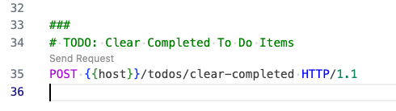

5. When you try to get the list again, there should be no more completed task in the list.

## Python

### Updating the Unit Test

1. In the **"Backend App"** workspace, open the test file: `test_todos.py`

2. Near the end of the file (after line 81), add this test function:

   ```python
   def test_clear_completed_tasks():
       client.post("/todos/", json={"task": "Done task 1", "completed": True})
       client.post("/todos/", json={"task": "Done task 2", "completed": True})
       client.post(
           "/todos/", json={"task": "Procrastinating task", "completed": False})

       response = client.post("/todos/clear-completed")
       assert response.status_code == 200
       assert response.json() == {"message": "Completed Tasks Deleted"}

       response = client.get("/todos")
       assert response.status_code == 200
       data = response.json()
       assert len(data) == 1
       assert data[0]["task"] == "Procrastinating task"
   ```

   - The test code will first **Arrange** the stuff we need before we run the test code. In this case, it is creating a 3 To Do items in the Database first - 2 of which are already marked as completed. We sometimes call this a Data Fixture.
   - Next we will **Act** - by executing the new API endpoint.
   - Lastly, we will **Assert** the result (or side effect) of the action above. After making the API call, the completed tasks should be removed from the Database. As such there should only be 1 To Do item left in the database.

   > **Note:** Remember to save the file.

3. Let's run the test by pressing on the "Play" button tha appears in the left gutter next to your test function.

   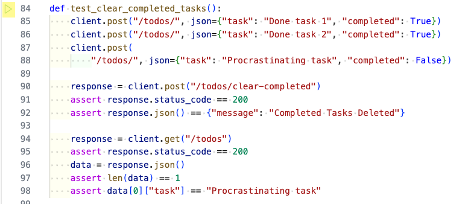

4. The first time you run this, the test should fail (and it's okay). This is because we have not written any production code yet.

   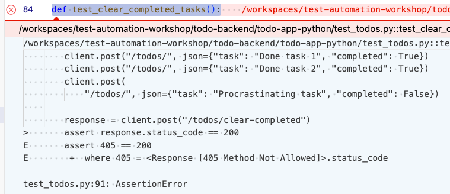

   Now we can proceed to add the production code.

### Updating the Code

1. Open the file: `app/crud.py`

2. At the top of file, after line 1, add this new line:

   ```python
   from sqlalchemy import delete
   ```

3. Near the bottom of the file (after line 38), add this new function:

   ```python
   def delete_completed_todos(db: Session):
      stmt = delete(models.TodoItem).where(
          models.TodoItem.completed.__eq__(True))
      db.execute(stmt)
      db.commit()
   ```

   This will add the Clear Completed To Do items functionality to the DB operations.

   > **Note:** Remember to save the file.

4. Next, open the file: `app/main.py` and this this at the end of the file:

   ```python
   @app.post("/todos/clear-completed")
   def clear_completed(db: Session = Depends(get_db)):
       crud.delete_completed_todos(db)
       return {"message": "Completed Tasks Deleted"}
   ```

   This will add the API endpoint to clear completed To Do items.

   > **Note:** Remember to save the file.

5. You can now go back to the test file (`test_todos.py`) and rerun the test by clicking on the red "X" icon in the left gutter next to your test function.

   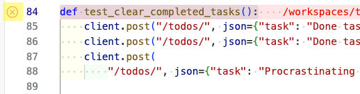

6. Your test should now pass:

   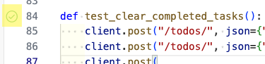

   And the right panel should also reflect your test run was successful.

   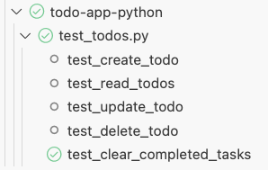

7. To check that you did not introduce any regression bugs, it's a good practice to run the entire test suite to ensure that all the tests are still passing.

   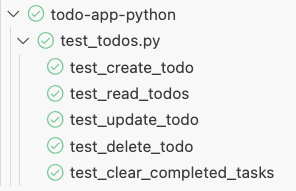

### Trying out the new function

1. Start the **"Backend App"** by running the command: `make run`.

2. Open `docs/todo.http` file.

3. Create a few Tasks by sending the `Create new To Do Item` request a few times. Mark the last one as completed (`"completed": true`).

4. Click on the "Send Request" button for the `Clear Completed To Do Items` request.

   

5. When you try to get the list again, there should be no more completed task in the list.

## Java

With the Java implementation, we have quite a number of files to update. We will make the changes from the inside out - starting with the **Repository**, then the **Service**, and finally the **Controller** integration test.

### Updating the Repository

1. In the **"Backend App"** workspace, open the test file: `src/main/java/com/tddworkshops/todolist/repository/TodoRepository.java`

2. In the interfacce class, add this line:

   ```java
   void deleteCompleted();
   ```

   This will add the method to delete all completed To Do items.

   > **Note:** Remember to save the file.

3. Next we add the unit test to check this behavior. Open the test file: `src/test/java/com/tddworkshops/todolist/repository/TodoRepositoryTest.java`

4. In the `TodoRepositoryTest` class (add a new line after line 32), add this test function:

   ```java
   @Test
    void whenDeletedByCompleted_thenReturnAllUnclearedTodos() {
        // Arrange
        Todo task1 = new Todo(null, "Incomplete Task", false);
        Todo task2 = new Todo(null, "Completed Task", true);
        todoRepository.save(task1);
        todoRepository.save(task2);

        // Act - Remove all completed tasks
        todoRepository.deleteByCompleted(true);

        // Assert
        List<Todo> todoList = todoRepository.findAll();
        assertThat(todoList).hasSize(1);
        assertThat(todoList.get(0).getTask()).isEqualTo("Incomplete Task");

        // Act - Remove all incomplete tasks
        todoRepository.deleteByCompleted(false);

        // Assert
        todoList = todoRepository.findAll();
        assertThat(todoList).hasSize(0);
    }
   ```

   - The test code will first **Arrange** the stuff we need before we run the test code. In this case, it is creating a 2 To Do items in the Database first - 1 of which are already marked as completed. We sometimes call this a Data Fixture.
   - Next we will **Act** - by executing the new method.
   - Lastly, we will **Assert** the result (or side effect) of the action above. After making the API call, the completed tasks should be removed from the Database. As such there should only be 1 To Do item left in the database.

   > **Note:** Remember to save the file.

5. Let's run the test by pressing on the "Play" button tha appears in the left gutter next to your test function.

   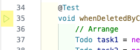

6. That unit test should pass.

   

### Updating the Service

1. Let's use the new **Repository** method in the **Service**. Open the file: `src/main/java/com/tddworkshops/todolist/service/TodoService.java`

2. In the `TodoService` class, add this new method:

   ```java
   @Transactional
   public void clearCompletedTodos() {
       todoRepository.deleteByCompleted(true);
   }
   ```

   - This will add the method to clear all completed To Do items.
   - You might see an error with the `@Transactional` annotation. You can hover your cursor on the error, click on **"Quick Fix"**, and select **"Import Tranactional (org.springframework.transaction.annotation)"**.
   - Or you can fix this by adding the following import statement at the top of the file:

     ```java
     import org.springframework.transaction.annotation.Transactional;
     ```

   > **Note:** Remember to save the file.

3. As this new method is only 1 line, and we have already tested the functionality in the **Repository** test, we do not need to add a new test for this method.

### Updating the Controller

1. Let's use the new **Service** method in the **Controller**. Open the file: `src/main/java/com/tddworkshops/todolist/controller/TodoController.java`

2. In the `TodoController` class, add this new method:

   ```java
   @PostMapping("/clear-completed")
   public ResponseEntity<String> clearCompletedTodos() {
       todoService.clearCompletedTodos();
       return ResponseEntity.ok("Completed Tasks Deleted");
   }
   ```

   - This will add the API endpoint to clear completed To Do items.

   > **Note:** Remember to save the file.

3. Next, we update our Intgeration test to check this behavior. Open the file: `src/test/java/com/tddworkshops/todolist/TodolistApplicationTests.java`

4. Add these 2 new code block to the `test_create_todo()` test.

   ```java
   // Create completed task
   	webTestClient.post()
   			.uri("/todos")
   			.contentType(MediaType.APPLICATION_JSON)
   			.bodyValue("{\"task\": \"Completed Task\", \"completed\": true}")
   			.exchange()
   			.expectStatus()
   			.isOk();

   	// Validate cleared completed tasks
   	webTestClient.post()
   			.uri("/todos/clear-completed")
   			.exchange()
   			.expectStatus()
   			.isOk()
   			.expectBody(String.class)
   			.isEqualTo("Completed Tasks Deleted");
   ```

5. Next we run the test by pressing on the "Play" button tha appears in the left gutter next to your test function.

   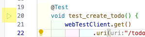

6. That unit test should pass.

   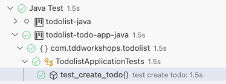

### Trying out the new function

1. Start the **"Backend App"**.

2. Open `docs/todo.http` file.

3. Create a few Tasks by sending the `Create new To Do Item` request a few times. Mark the last one as completed (`"completed": true`).

4. Click on the "Send Request" button for the `Clear Completed To Do Items` request.

   

5. When you try to get the list again, there should be no more completed task in the list.

### Refactoring

1. You'll notice that the API response from the `/clear-completed` endpoint is just a simple message. We can refactor this to return a JSON object instead.

2. First, let's update the Integration test to check for the new JSON response. Open the file: `src/test/java/com/tddworkshops/todolist/TodolistApplicationTests.java`

3. Update the test code block to check for the new JSON response:

   ```java
   // Validate cleared completed tasks
   webTestClient.post()
           .uri("/todos/clear-completed")
           .exchange()
           .expectStatus()
           .isOk()
           .expectBody()
           .jsonPath("$.message").isEqualTo("Completed Tasks Deleted");
   ```

4. Run the Integration test by pressing on the "Play" button that appears in the left gutter next to your test function.
   

5. The last portion of the test should fail.

   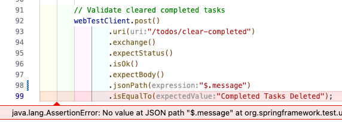

6. Next, open the file: `src/main/java/com/tddworkshops/todolist/controller/TodoController.java`.

7. Update the `clearCompletedTodos` method to return a JSON object instead of a String:

   ```java
   @PostMapping("/clear-completed")
   public ResponseEntity<Map<String, String>> clearCompletedTodos() {
       todoService.clearCompletedTodos();
       return ResponseEntity.ok(Map.of("message", "Completed Tasks Deleted"));
   }
   ```

   - We changed the `ResponseEntity` to return a `Map<String, String>` object.
   - We use the `Map.of` method to create a new Map object with the key-value pair of `message` and `Completed Tasks Deleted`.
   - You might see an error with the `Map` method. You can hover your cursor on the error, click on **"Quick Fix"**, and select **"Import Map (java.util)"**.

8. Run the Integration test again. It should now pass.

9. Run all the tests to ensure that everything is still working as expected.

   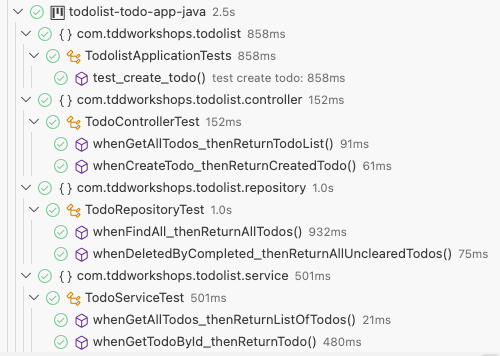

[Next Exercise](./exercise11.md)
