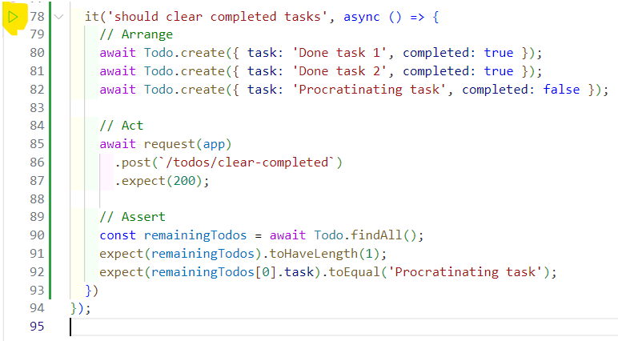
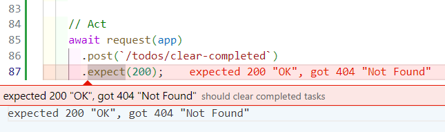
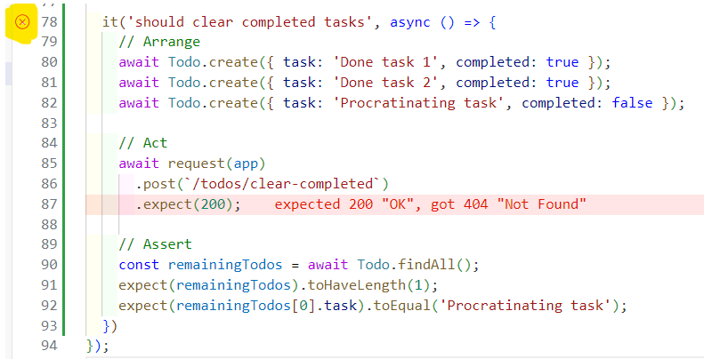
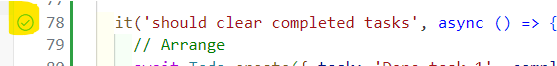
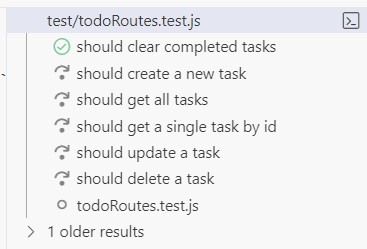
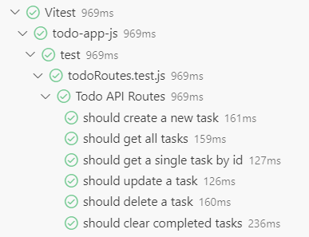

# Exercise 10: Updating the Backend

Let's work on the first user story:

- [ ] `AC-1`: **Backend** API endpoint (`POST /todos/clear-completed`) to clear completed To Do Tasks.

Skip to the portion for your preferred programming language:

- [JavaScript](#javascript)
- [Python](#python)
- [Java](#java)

## JavaScript

### Updating the Unit Test

1. In the **"Backend App"** workspace, open the test file: `test/todoRoutes.test.js`

2. Near the end of the file (after line 76), add this test function:

    ```javascript
    it('should clear completed tasks', async () => {
      // New test goes here...
    })
    ```

3. We will add the new test code now:

    ```javascript
    it('should clear completed tasks', async () => {
      // Arrange
      await Todo.create({ task: 'Done task 1', completed: true });
      await Todo.create({ task: 'Done task 2', completed: true });
      await Todo.create({ task: 'Procratinating task', completed: false });

      // Act
      await request(app)
      .post(`/todos/clear-completed`)
      .expect(200);

      // Assert
      const remainingTodos = await Todo.findAll();
      expect(remainingTodos).toHaveLength(1);
      expect(remainingTodos[0].task).toEqual('Procratinating task');
    })
    ```

    - The test code will first **Arrange** the stuff we need before we run the test code. In this case, it is creating a 3 To Do items in the Database first - 2 of which are already marked as completed. We sometimes call this a Data Fixture.
    - Next we will **Act** - by executing the new API endpoint.
    - Lastly, we will **Assert** the result (or side effect) of the action above. After making the API call, the completed tasks should be removed from the Database. As such there should only be 1 To Do item left in the database.

    > **Note:** Remember to save the file.

4. Let's run the test by pressing on the "Play" button tha appears in the left gutter next to your test function.

    

5. The first time you run this, the test should fail (and its okay). This is because we have not written any production code yet.

    

    Now we can proceed to add the production code.

### Updating the Code

1. Open the file: `index.js`

2. Near the bottom of the file (after line 75), add this new function:

    ```javascript    
    // Delete tasks that has been marked completed
    app.post('/todos/clear-completed', async (req, res) => {
      try {
        await ToDo.destroy({
          where: {
            completed: true
          }
        });

        res.json({ message: 'Completed Tasks Deleted' });
      } catch (err) {
        res.status(500).json({ error: err.message });
      }
    });
    ```

    > **Note:** Remember to save the file.

3. You can now go back to the test file (`test/todoRoutes.test.js`) and rerun the test by clicking on the red "X" icon in the left gutter next to your test function.

    

4. Your test should now pass:

    

    And the right panel should also reflect your test run was successful.

    

5. To check that you did not introduce any regression bugs, its a good practice to run the entire test suite to ensure that all the tests are still passing.

    

### Trying out the new function

TODO

## Python

### Updating the Unit Test

TODO

### Updating the Code

TODO

## Java

### Updating the Unit Test

TODO

### Updating the Code

TODO

[Next Exercise](./exercise11.md)
