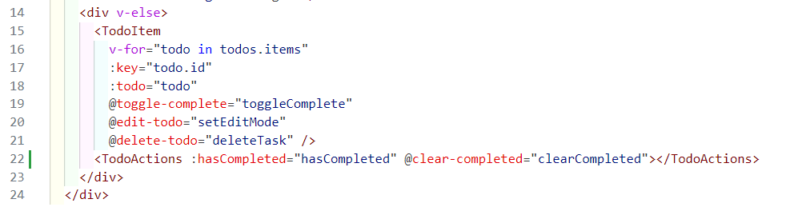
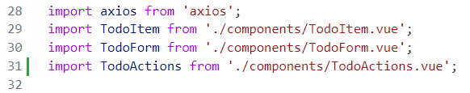
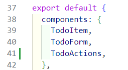
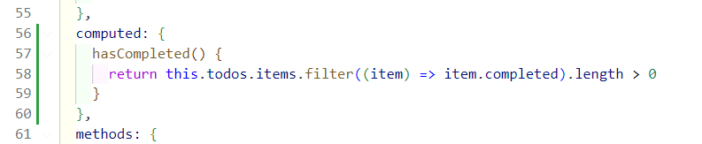
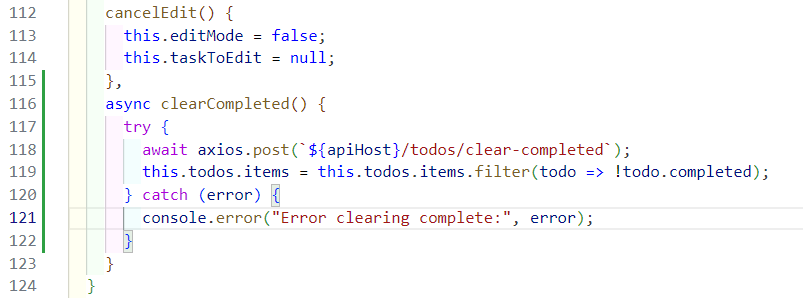

# Exercise 11: Updating the Frontend

Let's work on the next 2 user stories:

- [ ] `AC-2`: **"Clear Completed" button** in the **front-end** that is only enabled when there are some Tasks that are marked a "Done".
- [ ] `AC-3`: When we click on the **"Clear Completed" button**, an API call should be triggered to the Backend API (`POST /todos/clear-completed`) in `AC-1` above.

## Create a new Vue Component for "Clear Completed" button

1. Open up the **"Frontend App"** workspace.

2. Create an empty component first. In the `src` > `components` folder, create a new file: `TodoActions.vue`.  The new file should be loaded in the editor window upon creating the file.

3. Here's what you should use for the component file:

    ```javascript
    <template>
      <div id="todoActions">
        <button v-if="hasCompleted" class="clearCompletedBtn" type="button" @click="doClearCompleted">Clear Completed</button>
      </div>
    </template>

    <script>
    export default {
      props: {
        hasCompleted: Boolean
      },
      methods: {
        doClearCompleted() {
          this.$emit('clear-completed');
        }
      }
    }
    </script>

    <style>
      button.clearCompletedBtn {
        font-size: small;
        background-color: goldenrod;
      }
    </style>
    ```

4. In the `test` folder, create a new file: `TodoActions.spec.js`. The new file should be loaded in the editor window.

5. Add these lines to the file first:

    ```javascript
    import { mount } from '@vue/test-utils'
    import TodoActions from '../src/components/TodoActions.vue'
    import { describe, expect, it } from 'vitest'

    describe('TodoActions.vue', () => {
      // Test will go here
    })
    ```

    - This will import the files needed for the test code.
    - We will also import the Vue component that we just created in step 2 (i.e. `TodoActions.vue`)
    - And we created a place holder for the test function.

6. Let's add the first test (i.e. _**"it should hide clear completed button when no To Do completed"**_):

    ```javascript
    describe('TodoActions.vue', () => {
      it('should hide clear completed button when no To Do completed', () => {
        const wrapper = mount(TodoActions, {props: { hasCompleted: false }})

        expect(wrapper.find('.clearCompletedBtn').exists()).toBe(false)
      })
    })
    ```

    - We are testing that the button should not appear when there are no completed task.
    - For simplicity, we will compute the Boolean value (`true`/`false`) of whether there are completed tasks in the list outside of this component.
    - In doing so, we isolate the component from the implementation detail of how how many completed tasks there are in the list.
    - All the component needs to know is "should I show the Clear Completed button?" via the `hasCompleted` property.

    You can try to run the test first. It should pass.

7. Let's add the 2nd set of tests. Add this after the first test's `it` block.

    ```javascript
    describe('when there are completed tasks', () => {
      it('should show clear completed button', () => {
        const wrapper = mount(TodoActions, {props: { hasCompleted: true }})
    
        expect(wrapper.get('.clearCompletedBtn').isVisible()).toBe(true)
      })

      it('emits clear-completed event when clicked on Clear Completed', async () => {
        const wrapper = mount(TodoActions, {props: { hasCompleted: true }})

        await wrapper.get('.clearCompletedBtn').trigger('click');
    
        expect(wrapper.emitted()['clear-completed']).toBeTruthy();
      })
    })
    ```

    - Now that we can show the button, we will make the component emit a JS event when clicked.
    - This event can be passed back to the parent component for processing (i.e. To make the network API call to update the To Do List.)

    Try to run the test. It should pass.

8. The completed test file should look like this:

    ```javascript
    import { mount } from '@vue/test-utils'
    import TodoActions from '../src/components/TodoActions.vue'
    import { describe, expect, it } from 'vitest'

    describe('TodoActions.vue', () => {
      it('should hide clear completed button when no To Do completed', () => {
        const wrapper = mount(TodoActions, {props: { hasCompleted: false }})

        expect(wrapper.find('.clearCompletedBtn').exists()).toBe(false)
      })

      describe('when there are completed tasks', () => {
        it('should show clear completed button', () => {
          const wrapper = mount(TodoActions, {props: { hasCompleted: true }})
      
          expect(wrapper.get('.clearCompletedBtn').isVisible()).toBe(true)
        })

        it('emits clear-completed event when clicked on Clear Completed', async () => {
          const wrapper = mount(TodoActions, {props: { hasCompleted: true }})

          await wrapper.get('.clearCompletedBtn').trigger('click');
      
          expect(wrapper.emitted()['clear-completed']).toBeTruthy();
        })
      })
    })
    ```

9. Run all the frontend app tests to ensure we did not introduce any regression bugs.

## Add the new component to `App.vue`

1. Open the file: `src` > `App.vue`.

2. Add a new line after line 21, and add this code:

    ```javascript
    <TodoActions :hasCompleted="hasCompleted" @clear-completed="clearCompleted"></TodoActions>
    ```

    It should look like:

    

3. Add a new line after line 30, and add this code:

    ```javascript
    import TodoActions from './components/TodoActions.vue';
    ```

    It should look like:

    

4. Add a new line after line 40, and add this code:

    ```javascript
    TodoActions,
    ```

    It should look like:

    

5. Add a new line after line 55, and add this code:

    ```javascript
    computed: {
      hasCompleted() {
        return this.todos.items.filter((item) => item.completed).length > 0
      }
    },
    ```

    It should look like:

    

6. Add a new line after line 115, and add this code:

    ```javascript
    async clearCompleted() {
      try {
        await axios.post(`${apiHost}/todos/clear-completed`);
        this.todos.items = this.todos.items.filter(todo => !todo.completed);
      } catch (error) {
        console.error("Error clearing complete:", error);
      }
    }
    ```

    It should look like:

    


7. The updated `App.vue` file should look like this:

    ```javascript
    <template>
      <div>
        <h1>To Do List</h1>
        
        <!-- Add/Edit Form -->
        <TodoForm 
          :editMode="editMode"
          :taskToEdit="taskToEdit"
          @add-task="addTask"
          @update-task="updateTask"
          @cancel-edit="cancelEdit" />

        <div v-if="loading">Loading...</div>
        <div v-else>
          <TodoItem 
            v-for="todo in todos.items" 
            :key="todo.id" 
            :todo="todo" 
            @toggle-complete="toggleComplete"
            @edit-todo="setEditMode"
            @delete-todo="deleteTask" />
          <TodoActions :hasCompleted="hasCompleted" @clear-completed="clearCompleted"></TodoActions>
        </div>
      </div>
    </template>

    <script>
    import axios from 'axios';
    import TodoItem from './components/TodoItem.vue';
    import TodoForm from './components/TodoForm.vue';
    import TodoActions from './components/TodoActions.vue';

    const viteApiHost = import.meta.env.VITE_API_HOST;
    const apiHost = viteApiHost && viteApiHost !== 'https://-3000.' ? viteApiHost : 'http://localhost:3000';

    export default {
      components: {
        TodoItem,
        TodoForm,
        TodoActions,
      },
      data() {
        return {
          todos: {
            items: [],
          },
          loading: true,
          editMode: false,
          taskToEdit: null,
        };
      },
      async mounted() {
        this.fetchTodos();
      },
      computed: {
        hasCompleted() {
          return this.todos.items.filter((item) => item.completed).length > 0
        }
      },
      methods: {
        async fetchTodos() {
          this.loading = true;
          try {
            const response = await axios.get(`${apiHost}/todos`);
            this.todos.items = response.data;
          } catch (error) {
            console.error("Error fetching todos:", error);
          } finally {
            this.loading = false;
          }
        },
        async addTask(task) {
          try {
            const response = await axios.post(`${apiHost}/todos`, task);
            this.todos.items.push(response.data);
          } catch (error) {
            console.error("Error adding task:", error);
          }
        },
        async updateTask(updatedTask) {
          try {
            const response = await axios.put(`${apiHost}/todos/${updatedTask.id}`, updatedTask);
            const index = this.todos.items.findIndex(todo => todo.id === updatedTask.id);
            this.todos.items[index] = response.data;
            this.cancelEdit();
          } catch (error) {
            console.error("Error updating task:", error);
          }
        },
        async deleteTask(id) {
          try {
            await axios.delete(`${apiHost}/todos/${id}`);
            this.todos.items = this.todos.items.filter(todo => todo.id !== id);
          } catch (error) {
            console.error("Error deleting task:", error);
          }
        },
        async toggleComplete({ id, completed }) {
          try {
            const todo = this.todos.items.find(todo => todo.id === id);
            todo.completed = completed;
            await axios.put(`${apiHost}/todos/${id}`, todo);
          } catch (error) {
            console.error("Error toggling complete:", error);
          }
        },
        setEditMode(todo) {
          this.editMode = true;
          this.taskToEdit = todo;
        },
        cancelEdit() {
          this.editMode = false;
          this.taskToEdit = null;
        },
        async clearCompleted() {
          try {
            await axios.post(`${apiHost}/todos/clear-completed`);
            this.todos.items = this.todos.items.filter(todo => !todo.completed);
          } catch (error) {
            console.error("Error clearing complete:", error);
          }
        }
      }
    }
    </script>

    <style>
    /* Add some basic styling */
    .todo-item {
      display: flex;
      align-items: center;
      justify-content: space-between;
      margin-bottom: 10px;
    }

    form {
      margin-bottom: 20px;
    }
    </style>
    ```

8. Try restarting the **"Frontend App"** and preview how this would look like in the browser. 

[Next Exercise](./exercise12.md)
