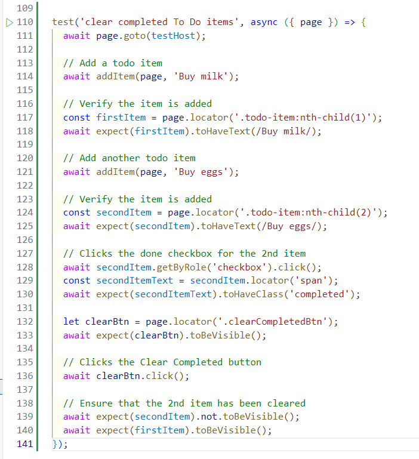

# Exercise 12: Updating the End-to-End Test

Now that we have a working frontend and backend implementation of **"Clear Completed"**, let's add some End-to-End test scenarios to complete the last user story:

- [ ] `AC-4`: Update the UI with the updated To Do List.

Skip to the portion for your preferred programming language:

- [JavaScript](#javascript)
- [Python](#python)
- [Java](#java)

## JavaScript

### Update the End-to-End Test

1. Open the **"End-to-End Tests"** workspace.

2. Open the E2E test file: `tests` > `todo-app.spec.js`.

3. Add this code to the end of the file:

   ```javascript
   test("clear completed To Do items", async ({ page }) => {
     await page.goto(testHost);

     // Add a todo item
     await addItem(page, "Buy milk");

     // Verify the item is added
     const firstItem = page.locator(".todo-item:nth-child(1)");
     await expect(firstItem).toHaveText(/Buy milk/);

     // Add another todo item
     await addItem(page, "Buy eggs");

     // Verify the item is added
     const secondItem = page.locator(".todo-item:nth-child(2)");
     await expect(secondItem).toHaveText(/Buy eggs/);

     // Clicks the done checkbox for the 2nd item
     await secondItem.getByRole("checkbox").click();
     const secondItemText = secondItem.locator("span");
     await expect(secondItemText).toHaveClass("completed");

     let clearBtn = page.locator(".clearCompletedBtn");
     await expect(clearBtn).toBeVisible();

     // Clicks the Clear Completed button
     await clearBtn.click();

     // Ensure that the 2nd item has been cleared
     await expect(secondItem).not.toBeVisible();
     await expect(firstItem).toBeVisible();
   });
   ```

   It should look like this:

   

4. Click the **"Play"** button in the left gutter next to the test function to trigger this end-to-end test.

   > **Note:** Make sure the **"Frontend App"** and **"Backend App"** are running before you run this test.

## Python

### Updating the Code

1. Open the **"End-to-End Tests"** workspace.

2. Open the E2E test file: `test_todo_app.py`.

3. Add this code to the end of the file:

   ```python
   def test_clear_completed_todo_items(page):
       page.goto(testHost)

       addItem(page, 'Buy milk')
       firstItemText = page.locator('.todo-item:nth-child(1) span')
       expect(firstItemText).to_have_text('Buy milk')

       addItem(page, 'Buy eggs')
       secondItem = page.locator('.todo-item:nth-child(2)')
       secondItemText = page.locator('.todo-item:nth-child(2) span')
       expect(secondItemText).to_have_text('Buy eggs')

       secondItem.get_by_role('checkbox').click()
       expect(secondItemText).to_have_class('completed')

       clearBtn = page.locator('.clearCompletedBtn')
       expect(clearBtn).to_be_visible()

       clearBtn.click()
       expect(secondItem).not_to_be_visible()
       expect(firstItemText).to_be_visible()
   ```

4. Click the **"Play"** button in the left gutter next to the test function to trigger this end-to-end test.

   > **Note:** Make sure the **"Frontend App"** and **"Backend App"** are running before you run this test. Restart the backend application and run the **whole** test suite.

## Java

### Updating the Code

1. Open the **"End-to-End Tests"** workspace.

2. Open the E2E test file: `src/test/java/com/tddworkshops/todolist/TodoAppTest.java`.

3. Add this code to the end of the file:

   ```java
   @Test
   @Order(6)
   void check_mark_completed(Page page) {
      page.navigate(TEST_HOST);

      addItem(page, "Buy milk");
      var firstItem = page.locator(".todo-item:nth-child(1)");
      assertThat(firstItem).containsText("Buy milk");

      addItem(page, "Buy eggs");
      var secondItem = page.locator(".todo-item:nth-child(2)");
      assertThat(secondItem).containsText("Buy eggs");
      secondItem.getByRole(AriaRole.CHECKBOX).click();

      var secondItemStatus = secondItem.locator("span");
      assertThat(secondItemStatus).hasClass("completed");

      var clearBtn = page.locator(".clearCompletedBtn");
      assertThat(clearBtn).isVisible();

      clearBtn.click();

      assertThat(secondItem).not().isVisible();
      assertThat(firstItem).isVisible();
   }
   ```

4. Click the **"Play"** button in the left gutter next to the test function to trigger this end-to-end test.

   > **Note:** Make sure the **"Frontend App"** and **"Backend App"** are running before you run this test.

[Next Exercise](./exercise13.md)
