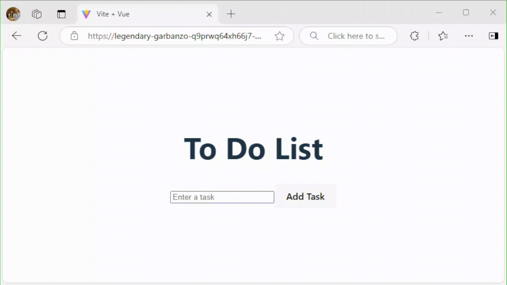

# Exercise 13: Review the changes

Let's recap what we are supposed to build:

```Gherkin
As a User,
When I have added multiple Tasks to the To Do List,
And I have marked some Task as "Done",
Then the "Clear Completed" button should be enabled.

When I click on "Clear Completed",
Then I should only see "Undone" Tasks on the To Do list.
```

## Completed Feature Walkthrough

After you have implemented the **"Clear Completed"** feature, the application should look like this:



