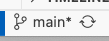
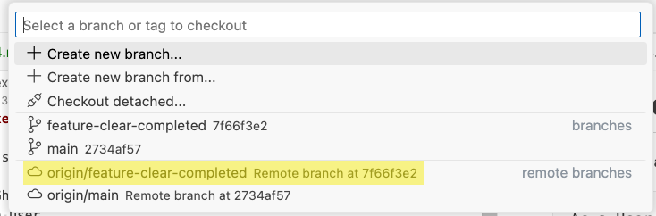

# Exercise 13: Review the changes

Let's recap what we are supposed to build:

```Gherkin
As a User,
When I have added multiple Tasks to the To Do List,
And I have marked some Task as "Done",
Then the "Clear Completed" button should be enabled.

When I click on "Clear Completed",
Then I should only see "Undone" Tasks on the To Do list.
```

## Completed Feature Walkthrough

After you have implemented the **"Clear Completed"** feature, the application should look like this:


## Reference Implementation

You can view the completed implementation of the **"Clear Completed"** feature in the `feature-clear-completed` branch.

1. To check out the branch, on the bottom left of the Visual Studio Code window, click on the current branch name: `main`

   

2. Select `feature-clear-completed`.

   

3. You will be able to see the completed solution for exercises 10, 11 and 12.

[Bonus Exercises](./exercise14.md)
