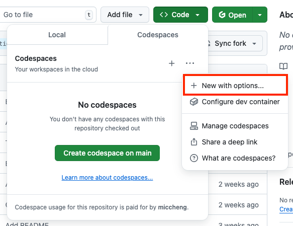
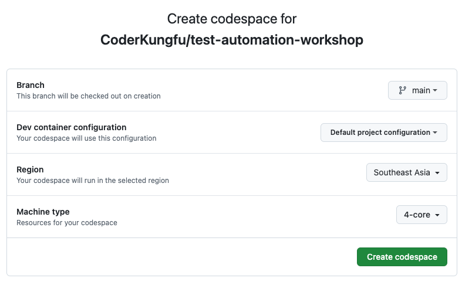
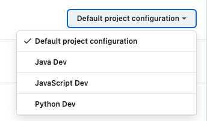
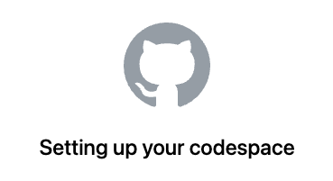
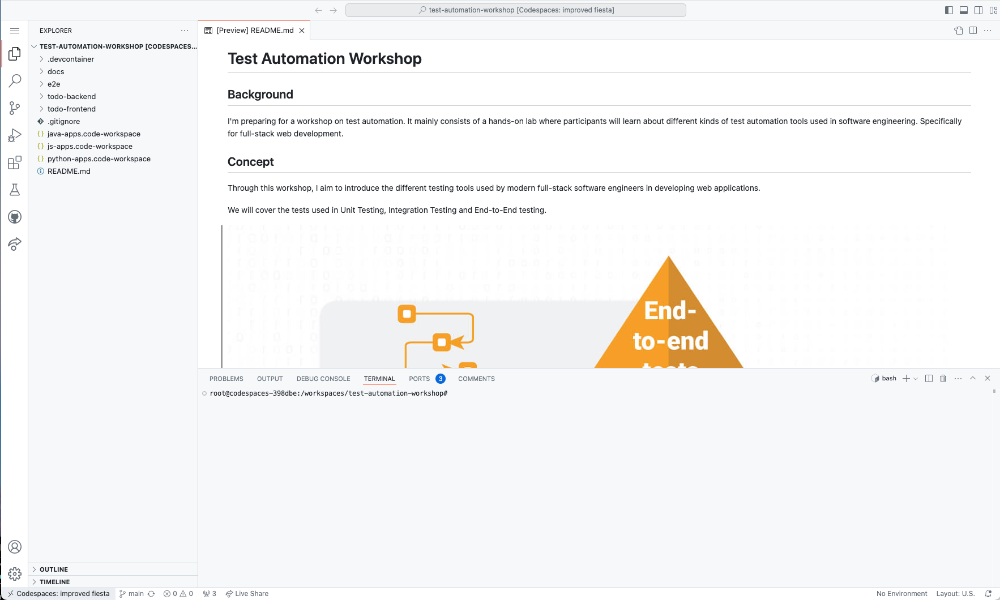
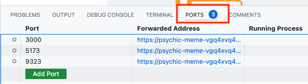
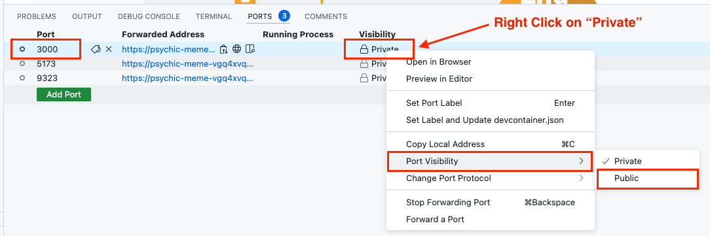

# Exercise 2: Start a Codespace

> **WARNING**: Please follow through the instructions step by step very **carefully** and not press buttons that are not mentioned inside this doc.

1. In your forked repository page, click on **"Code"**, click on the 3 dots (**"..."**) button and select **"New with Options"**.

   

2. You will see a form that lets you create your [Codespace](https://docs.github.com/en/codespaces).

   

3. In the **"Dev container configuration"** row, select the configuration for your preferred programming language. You will be using this programming language for the To Do List backend and test codes.

   

   > **Example:** If you would like to do this exercise in **JavaScript**, select the **"JavaScript Dev"** configuration.

4. Next, change **Machine Type** to **"4-core"**.

   

5. Click on **"Create codespace"**.

6. Your Codespace will take a few minutes to be setup. It will open a new browser tab.

   

7. Your Codespace is ready to be used.

   

8. Make Port `3000` a public port

   Select the **"Exposed Ports"** tab in the bottom panel:

   

   Right click on row for port `3000`, click on **"Port Visibility"** and change it to **"Public"**.

   

[Next Exercise](./exercise3.md)
