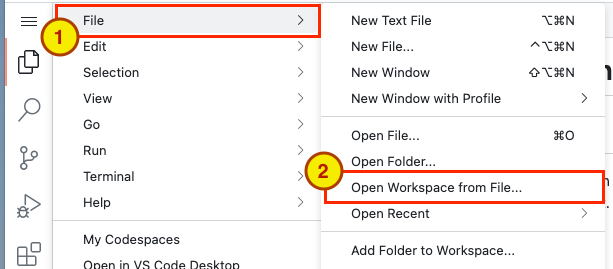
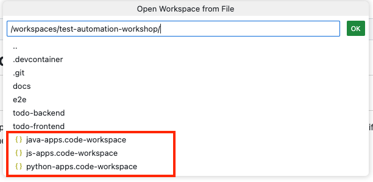
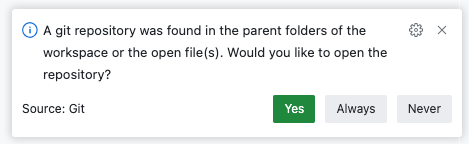
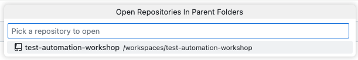

# Exercise 3: Open your Code Workspace

1. Open your workspace

   

2. Pick the `*.code-workspace` file for your programming language.

   

3. VSCode should reload and your project explorer should reflect the applications.

   

4. Select the Git repository.

   

   

[Next Exercise](./exercise4.md)
