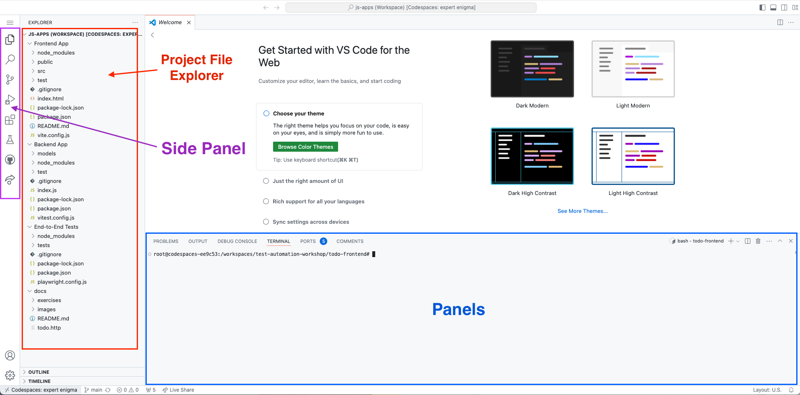
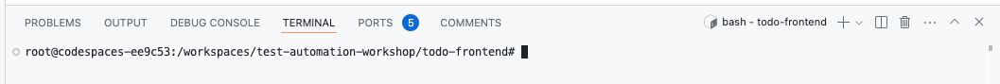
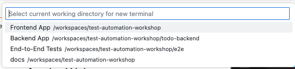
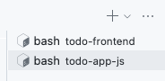

# Exercise 4: Intro to your IDE (Integrated Development Environment) - Visual Studio Code (VSCode)

## Side Bar

Your sidebar may look different depending on what VSCode extensions were installed with your dev container configuration.

This is what the **"JavaScript Dev"** dev container configuration loads with:

## Terminal Panel

The [Terminal](https://www.technigo.io/explained/what-is-the-terminal) is like the **File Explorer** (Windows) / **Finder** (MacOS). Instead of clicking into folders and double-clicking to open a file, you type text commands to do so. We also refer to this as the **Console**, **Command Prompt** or **CLI**[^CLI].

When you click on **"+"** to create a new Terminal session (like a new File Explorer/Finder window), you can choose to start it in a project workspace.

You can switch between Terminal sessions by selecting the process name at the panel on the bottom right.

### Commonly used Terminal commands

Use these to navigate around the file system in the Devcontainer.

Command | Task | Examples
:------ | :--- | :-------
`cd <folder_name>` | Change directory / navigate to a different directory. | `cd src`
`cd ..` | Navigate the parent directory (one level up). | `cd ../test`
`ls` | List the files and directories in the current folder | `ls`
`ls -al` | Different formatting of the listing | `ls -al`
`ls -al <folder_name>` | List the files in a different folder without navigating to it.  | `ls -al assets`

## Project Explorer

### Things to note:

- To open a file, double click on the file name.
- To preview a file without opening it, single click on the file name.
- Remember to save the file after making changes to it.

[Next Exercise](./exercise5.md)

[^CLI]: Command Line Interface