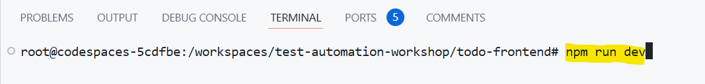
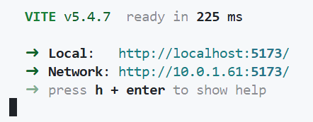
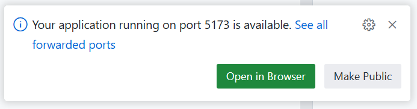
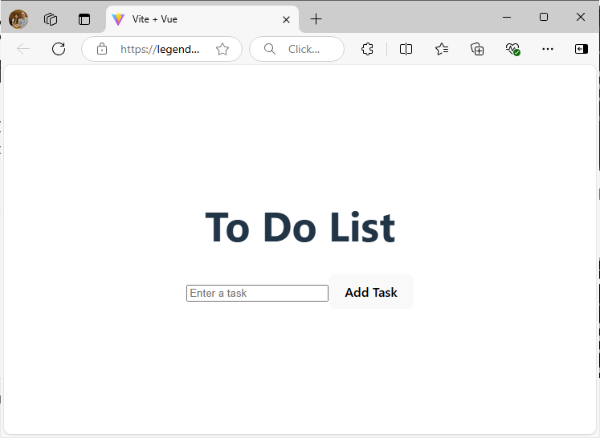
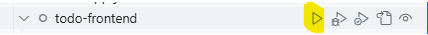
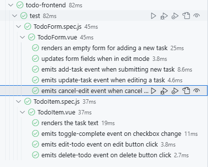
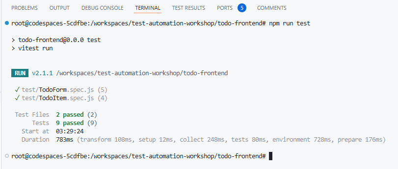

# Exercise 5: Intro to the Frontend App

## Starting the App

1. Click on the **"Terminal"** tab

    

2. Click on **"+"** (on the far right of the tab bar) to create a **"New Terminal Session"**.

3. If you opened the workspace from [Exercise 3](./exercise3.md), you will be presented with a list of directories. Select the **"Frontend App"** option.

    

4. In the new Terminal window, type: `npm run dev`

    

5.  When you see this message, the Frontend app is now running and you can now access the To Do List application.

    

6. You will also see this prompt. Click on **"Open in Browser"** to view the application in a separate browser tab.

    

7. You should see this in the new browser tab:

    

    > **Note:** The To Do List app is not working now because we have not started the Backend App.

8. To stop the app, click into the Terminal where we started the Frontend App (in step 4) and press `Ctrl` + `c`. This will stop the Frontend App.

## Running the Unit Test

There are 2 ways to run the Unit Tests for the Frontend App:

### Using the [Test Explorer](https://code.visualstudio.com/docs/editor/testing#_automatic-test-discovery-in-test-explorer).

1. Click on the **"Testing"** icon on the left sidebar.

    

2. Open up all the tests in `Vitest` > `todo-frontend` > `test`

    

3. On the row with `todo-frontend` label, click on the **"Play"** button to run the unit tests.

    

4. You should see a bunch of green ticks to signify that all the tests are passing.

    

### In the Terminal.

1. In the **"Terminal"** tab, click on **"+"** (on the far right of the tab bar) to create a **"New Terminal Session"**.

    

2. If you opened the workspace from [Exercise 3](./exercise3.md), you will be presented with a list of directories. Select the **"Frontend App"** option.

    

3. In the new Terminal window, type: `npm run test`

    

4. You should see this display if all the tests are passing:

    

## Exploring the frontend app code

1. Click on the **"Explorer"** icon on the left sidebar.

    

2. Click on **"Frontend App"** to see all the folders under this workspace.

3. The application code can be found in `Frontend App` > `src`.

    - Can you figure out how we display the the To Do list?
    - Where are we making the network API call to the backend server?

4. The test code can be found in `Frontend App` > `test`.

    - Can you figure out what the code mean?

[Next Exercise](./exercise6.md)
