# Exercise 6: Intro to the Backend App

Skip to the portion for your preferred programming language:

- [JavaScript](#javascript)
- [Python](#python)
- [Java](#java)

JavaScript

## JavaScript

### Starting the App

1. Click on the **"Terminal"** tab

   

2. Click on **"+"** (on the far right of the tab bar) to create a **"New Terminal Session"**.

3. If you opened the workspace from [Exercise 3](./exercise3.md), you will be presented with a list of directories. Select the **"Backend App"** option.

   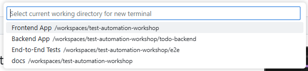

4. In the new Terminal window, type: `npm run dev`

   

5. When you see this message, the Backend app is now running and you can now use the To Do List Backend API.

   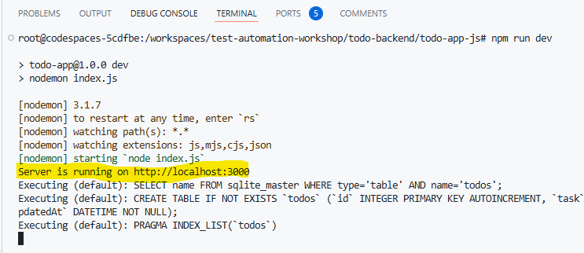

6. To access the app, open `docs/todo.http` file in the code editor (just click on it).

   We will be using the [REST Client](https://marketplace.visualstudio.com/items?itemName=humao.rest-client) extension to check the Backend REST API endpoints.

   Click on the **"Send Request"** link to do the API call. The response & result will show up in a **"Response"** tab.

   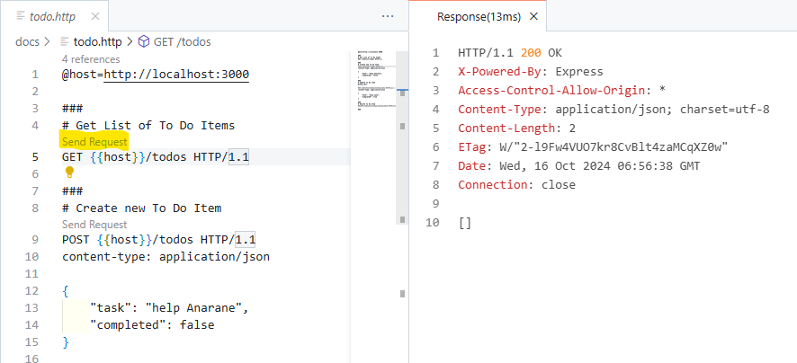

   Here are the API calls you can make:

   - `GET /todos` - will return a JSON array of To Do Items.
   - `POST /todos` - will create a new To Do Item.
   - `PUT /todos/{{task_id}}` - will update an existing To Do Item with a `task_id`.
   - `DELETE /todos/{{task_id}}` - will delete To Do Item with a `task_id`.

7. To stop the app, click into the Terminal where we started the Backend App (in step 4) and press `Ctrl` + `c`. This will stop the Backend App.

   > **Note:** Stopping the app will clear all the To Do List items in the database.

### Running the Unit Test

There are 2 ways to run the Unit Tests for the **"Backend App"**:

- Using the [Test Explorer](https://code.visualstudio.com/docs/editor/testing#_automatic-test-discovery-in-test-explorer).
  - This method is convenient when you are using VSCode and you can use your mouse to click on the test button.
- In the Terminal.
  - This method is recommended when you are running the test in Continuous Integration (CI) pipelines.

#### Using the [Test Explorer](https://code.visualstudio.com/docs/editor/testing#_automatic-test-discovery-in-test-explorer).

1. Click on the **"Testing"** icon on the left sidebar.

   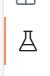

2. Open up all the tests in `Vitest` > `todo-app-js` > `test`

   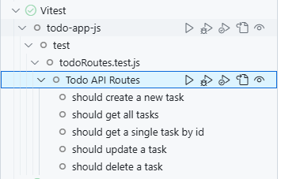

3. On the row with `todo-app-js` label, click on the **"Play"** button to run the unit tests.

   

4. You should see a bunch of green ticks to signify that all the tests are passing.

   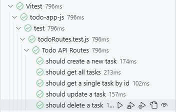

#### In the Terminal.

1. In the **"Terminal"** tab, click on **"+"** (on the far right of the tab bar) to create a **"New Terminal Session"**.

   

2. If you opened the workspace from [Exercise 3](./exercise3.md), you will be presented with a list of directories. Select the **"Backend App"** option.

   

3. In the new Terminal window, type: `npm run test`

   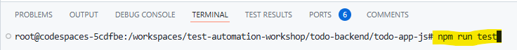

4. You should see this display if all the tests are passing:

   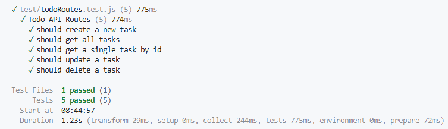

### Exploring the backend app code

1. Click on the **"Explorer"** icon on the left sidebar.

   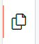

2. Click on **"Backend App"** to see all the folders under this workspace.

3. The application code can be found in `Backend App` directory.

   - Can you figure out how we display the To Do list?

4. The test code can be found in `Backend App` > `test`.

   - Can you figure out what the test code mean?

Python

## Python

### Starting the App

1. Click on the **"Terminal"** tab

   

2. Click on **"+"** (on the far right of the tab bar) to create a **"New Terminal Session"**.

3. If you opened the workspace from [Exercise 3](./exercise3.md), you will be presented with a list of directories. Select the **"Backend App"** option.

   

4. In the new Terminal window, type: `make run`

   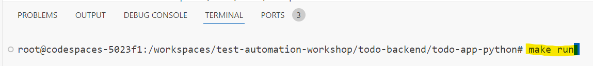

5. When you see this message, the Backend app is now running and you can now use the To Do List Backend API.

   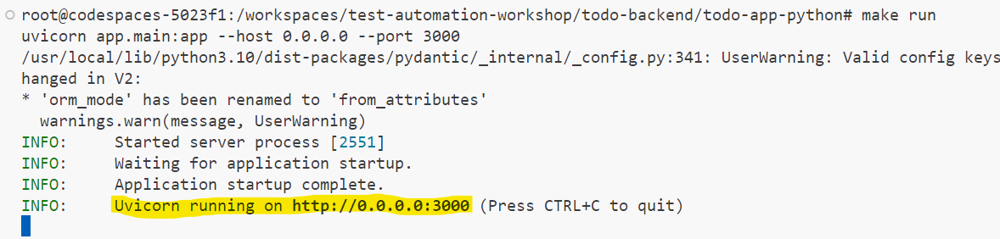

6. To access the app, open `docs/todo.http` file in the code editor (just click on it).

   We will be using the [REST Client](https://marketplace.visualstudio.com/items?itemName=humao.rest-client) extension to check the Backend REST API endpoints.

   Click on the **"Send Request"** link to do the API call. The response & result will show up in a **"Response"** tab.

   

   Here are the API calls you can make:

   - `GET /todos` - will return a JSON array of To Do Items.
   - `POST /todos` - will create a new To Do Item.
   - `PUT /todos/{{task_id}}` - will update an existing To Do Item with a `task_id`.
   - `DELETE /todos/{{task_id}}` - will delete To Do Item with a `task_id`.

7. To stop the app, click into the Terminal where we started the Backend App (in step 4) and press `Ctrl` + `c`. This will stop the Backend App.

   > **Note:** Stopping the app will clear all the To Do List items in the database.

### Running the Unit Test

There are 2 ways to run the Unit Tests for the Frontend App:

#### Using the [Test Explorer](https://code.visualstudio.com/docs/editor/testing#_automatic-test-discovery-in-test-explorer).

1. Click on the **"Testing"** icon on the left sidebar.

   

2. First, we need to configure the Python testing in VSCode.

   Press `ctrl` + `shift` + `p` (windows) / `cmd` + `shift` + `p` (macOS) to bring up the [Command Palette](https://code.visualstudio.com/api/ux-guidelines/command-palette).

   Next, type: `pytest`

   You should see this option show up in the Command Palette:

   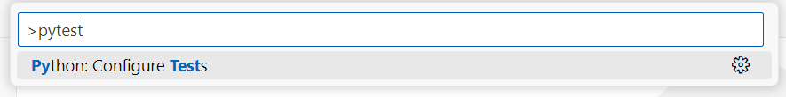

3. In the list of workspaces, select the **"Backend App"**.

   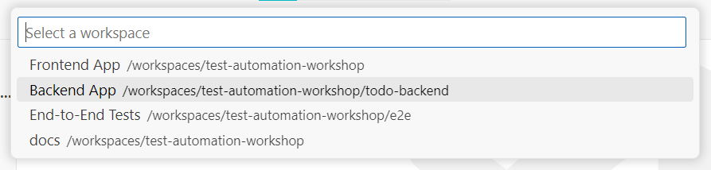

4. Next select the **"pytest"** Test Framework

   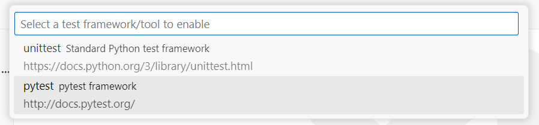

5. Next select the **"Root directory"** as the directory containing the tests.

   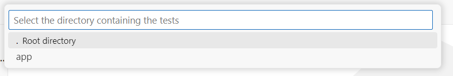

6. You should see the Python tests appear in the **"Test Explorer"**.

   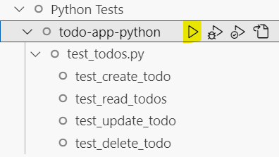

7. Open up all the tests in `Python Tests` > `todo-app-python` > `test_todos.py`

8. On the row with `todo-app-python` label, click on the **"Play"** button to run the unit tests.

9. You should see a bunch of green ticks to signify that all the tests are passing.

   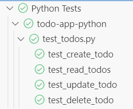

#### In the Terminal.

1. In the **"Terminal"** tab, click on **"+"** (on the far right of the tab bar) to create a **"New Terminal Session"**.

   

2. If you opened the workspace from [Exercise 3](./exercise3.md), you will be presented with a list of directories. Select the **"Backend App"** option.

   

3. In the new Terminal window, type: `make test`

   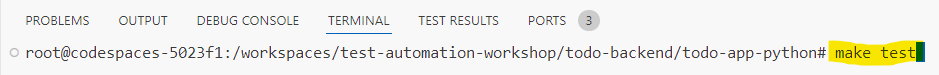

4. You should see this display if all the tests are passing:

   

### Exploring the backend app code

1. Click on the **"Explorer"** icon on the left sidebar.

   

2. Click on **"Backend App"** to see all the folders under this workspace.

3. The application code can be found in `Backend App` directory.

   - Can you figure out how we display the To Do list?

4. The test code can be found in `Backend App` > `test_todos.py`.

   - Can you figure out what the test code mean?

Java

## Java

### Starting the App

1. Open the **"Backend App"** workspace.

2. Open this file: `src/main/java/com/tddworkshops/todolist/TodolistApplication.java`

3. Click on **"Run"** at the top right hand corner.

   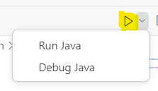

4. If you see this option, its due to Gradle importing all the dependencies.

   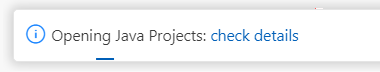

5. If you see these text in th your terminal, the **"Backend App"** is running now.

   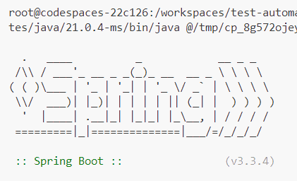

   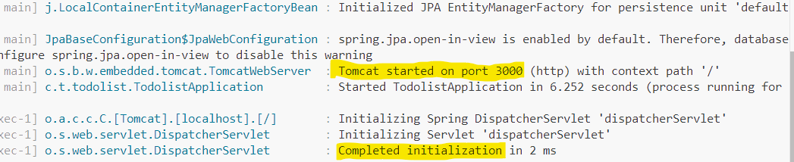

6. To access the app, open `docs/todo.http` file in the code editor (just click on it).

   We will be using the [REST Client](https://marketplace.visualstudio.com/items?itemName=humao.rest-client) extension to check the Backend REST API endpoints.

   Click on the **"Send Request"** link to do the API call. The response & result will show up in a **"Response"** tab.

   

   Here are the API calls you can make:

   - `GET /todos` - will return a JSON array of To Do Items.
   - `POST /todos` - will create a new To Do Item.
   - `PUT /todos/{{task_id}}` - will update an existing To Do Item with a `task_id`.
   - `DELETE /todos/{{task_id}}` - will delete To Do Item with a `task_id`.

7. To stop the app, click into the **"Stop button"**. This will stop the Backend App.

   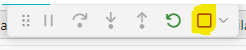

   > **Note:** Stopping the app will clear all the To Do List items in the database.

### Running the Unit Test

1. Click on the **"Testing"** icon on the left sidebar.

   

2. Open up all the tests in `Java Test` > `todolist-todo-app-java`

   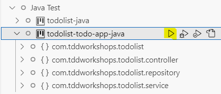

3. On the row with `todolist-todo-app-java` label, click on the **"Play"** button to run the unit tests.

4. You should see a bunch of green ticks to signify that all the tests are passing.

   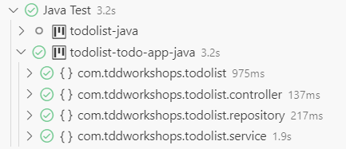

### Exploring the backend app code

1. Click on the **"Explorer"** icon on the left sidebar.

   

2. Click on **"Backend App"** to see all the folders under this workspace.

   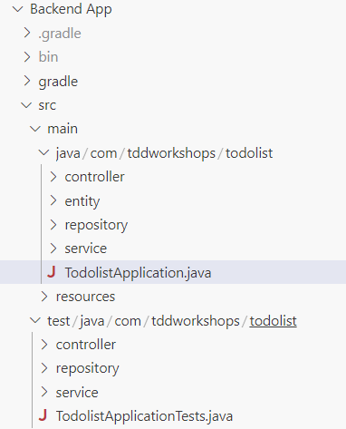

3. The application code can be found in `main` directory.

   - Can you figure out how we display the To Do list?

4. The test code can be found in `test` directory.

   - Can you figure out what the test code mean?

[Next Exercise](./exercise7.md)
