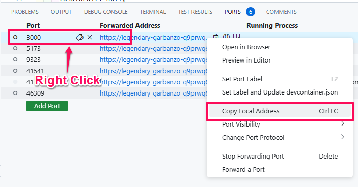
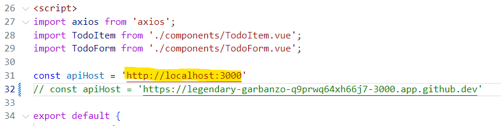

# Exercise 7: Intro to the Playwright End to End Test

## Update Frontend App to use the Backend App

1. Select the **"Ports"** tab in the bottom panel:

    

2. Right click on Port `3000` and select **""**

    

    This copies the public URL of the Backend App to your clipboard.

3. Open the **"Frontend App"** workspace and open the file: `src/App.vue`

4. Replace `http://localhost:3000` with the public URL of the Backend App.

    - Select `http://localhost:3000` in Line 31.
    - Right click and select **"Paste"**. (or just `Ctrl` + `v` (Windows) / `Cmd` + `v` (MacOS)).
    - Remove the trailing slash (`/`) from the URL.

    

    It should look like the text in line 32. 

5. Restart the **"Frontend App"** and **"Backend App"**.

6. Open the **"Frontend App"** public URL in your browser.

7. You should be able to interact with your To Do List app now.

    > **Note:** Remember to delete all the To Do List Items before you run the E2E tests below.   (**Pro-Tip**: Try restarting the **"Backend App"**.)

## JavaScript

### Running the End to End Test

#### Using the [Test Explorer](https://code.visualstudio.com/docs/editor/testing#_automatic-test-discovery-in-test-explorer).

1. Click on the **"Testing"** icon on the left sidebar.

    

2. Open up all the tests in `Playwright` > `js` > `tests`

    

3. On the row with `js` label, click on the **"Play"** button to run the unit tests.

    

4. You should see a bunch of green ticks to signify that all the tests are passing.

    

## Python

### Running the End to End Test

TODO

## Java

### Running the End to End Test

TODO

[Next Exercise](./exercise8.md)
