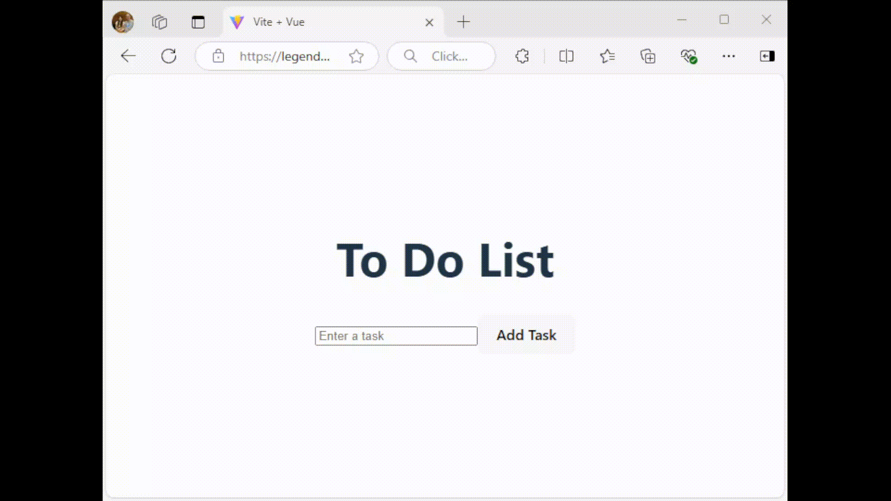

# Exercise 7: Running the To Do List app

1. Restart the **"Frontend App"** (refer to [Exercise 5](./exercise5.md)) and **"Backend App"** (refer to [Exercise 6](./exercise6.md)).

2. Open the **"Frontend App"** public URL in your browser (i.e. preview the application on port `5173` in the web browser).

3. You should be able to interact with your To Do List app now.

[Next Exercise](./exercise8.md)
