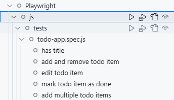
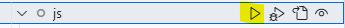
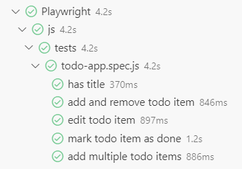
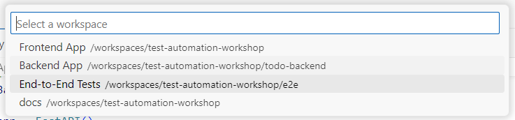
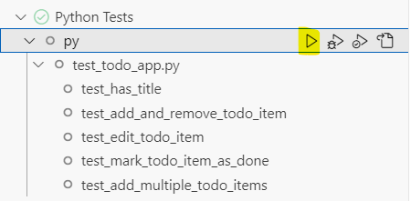
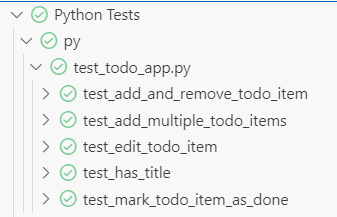
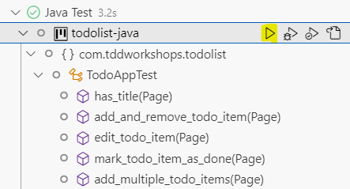
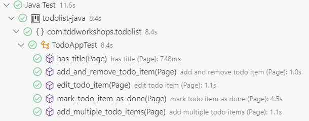
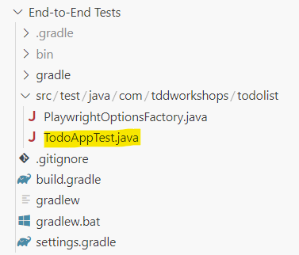

# Exercise 8: Intro to the Playwright End to End Test

We will be using [Playwright](https://playwright.dev) to build our end-to-end (E2E) test. Playwright is a cross-browser, cross-platform and cross-language tool for creating end-to-end tests for your web browser.

We can write the E2E test files using [JavaScript](#javascript), [Python](#python) or [Java](#java).

> **Note:** Make sure both the frontend and backend app are running (refer to [exercise 7](./exercise7.md) for instructions) before you start the E2E tests.

> **Note:** Remember to delete all the To Do List Items before you run the E2E tests below.   (**Pro-Tip**: Try restarting the **"Backend App"**.)

Skip to the portion for your preferred programming language:

- [JavaScript](#javascript)
- [Python](#python)
- [Java](#java)

## JavaScript

### Running the End to End Test (via [Test Explorer](https://code.visualstudio.com/docs/editor/testing#_automatic-test-discovery-in-test-explorer))

1. Click on the **"Testing"** icon on the left sidebar.

    

2. Open up all the tests in `Playwright` > `js` > `tests`

    

3. On the row with `js` label, click on the **"Play"** button to run the unit tests.

    

4. You should see a bunch of green ticks to signify that all the tests are passing.

    

### Exploring the E2E tests

You can view & edit the E2E test files (files with `*.spec.js` extension) in `End-to-End Tests` > `tests`.

## Python

### Running the End to End Test

1. Click on the **"Testing"** icon on the left sidebar to open the **"Test Explorer"**.

    

    You'll notice that the End-to-End Tests are not loaded yet.

2. We will need to configure the Python testing in VSCode.

    Press `ctrl` + `shift` + `p` (windows) / `cmd` + `shift` + `p` (MacOS) to bring up the [Command Palette](https://code.visualstudio.com/api/ux-guidelines/command-palette).

    Next, type: `pytest`

    You should see this option show up in the Command Palette:

    

3. In the list of workspaces, select the **"End-to-End Tests"**.

    

4. Next select the **"pytest"** Test Framework

    

5. Next select the **Root directory"** as the directory containing the tests.

    

6. You should see the Python tests appear in the **"Test Explorer"**.

    

7. Open up all the tests in `Python Tests` > `py` > `test_todo_app.py`

8. On the row with `py` label, click on the **"Play"** button to run the unit tests.

9. You should see a bunch of green ticks to signify that all the tests are passing.

    

## Java

### Running the End to End Test (via [Test Explorer](https://code.visualstudio.com/docs/editor/testing#_automatic-test-discovery-in-test-explorer))

1. Click on the **"Testing"** icon on the left sidebar.

    

2. Open up all the tests in `Java Test` > `todolist-java`

    

3. On the row with `todolist-java` label, click on the **"Play"** button to run the E2E tests.

4. You should see a bunch of green ticks to signify that all the tests are passing.

    

### Exploring the E2E tests

You can view & edit the E2E test files in `End-to-End Tests` workspace. Under the `src` directory.

[Next Exercise](./exercise9.md)
