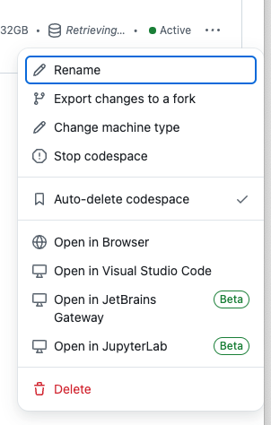

# Run the Codespaces on VSCode on your local machine

1. You will need to have the following installed on your laptop:

   - [Visual Studio Code](https://code.visualstudio.com/download)
   - [GitHub Codespaces extension](https://marketplace.visualstudio.com/items?itemName=GitHub.codespaces)

2. After you launched the Codespace in [Exercise 2](../exercises/exercise2.md), go to [Codespaces page](https://github.com/codespaces/)

3. On the row with your Codespace name, click on 3 dots and select **"Open in Visual Studio Code"**.

   

4. You will be prompted to install the GitHub Codespaces extension if its not installed.

5. You will also be prompted to login to your GitHub account.

6. Once you are logged in, you will see the Codespace loading in your VSCode.
